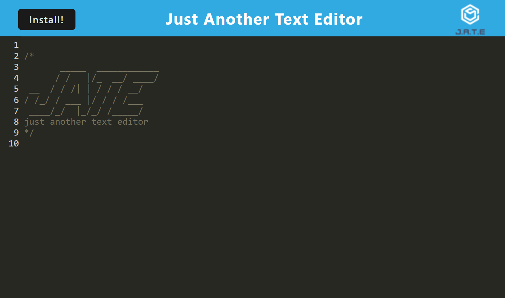
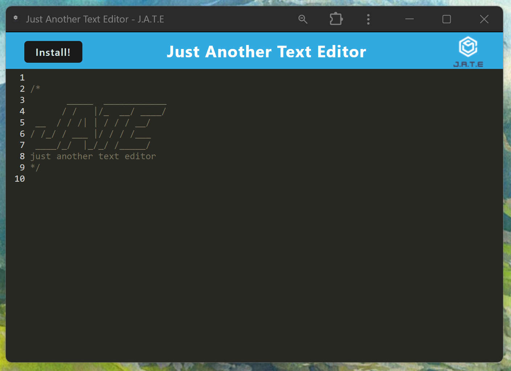

# Text_Editor_Erin_Mulcahey

## Description

My motivation was to build a text editor that runs in the browser, that would also be able to function offline. The app is a single-page application that meets the PWA criteria. It hasmmultiple techniques that serve as redundancy in case one of the options is not supported by the browser. This app shows how you can solve the problem of not being able to use a web application if there is no internet. I learned multiple methods that are useful for storing and retrieving data, how to make an app useable while offline, and using IndexedDB database for storing data.

## Installation

While in the browser, the user will see a download button in the upper left. The user can click that button to get the application downloaded onto their computer. Once downloaded onto their computer, the user can then use the app while their computer is in offline mode, or if they don't have a connect to the internet. 

## Usage

A user can type anything into the text editor. The editor will save what is typed. There is an online and an offline version. The application can be downloaded to use the offline version.

## Credits

N/A

## License

Please refer to the LICENSE in the repo.
